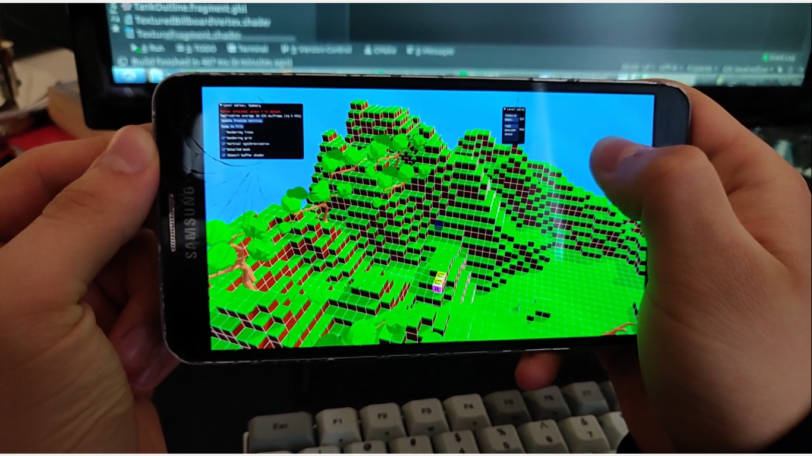

# Blue

Very basic rendering engine written in C++ over OpenGL.

Supports Android / Windows / Linux.

Tutorial code is provided under `examples` directory and will produce artifacts by default,
unless `-DBLUE_EXAMPLES=OFF` is passed during CMake configuration.

Examples cover:

1. Create window
2. Render triangle
3. Load model (included) and render
4. Same as 3, but with FPS camera
5. Imgui integration (TODO)
6. Textured rectangle (TODO)



## Dependency matrix

| Dependency           | Version              | Purpose                                                                                        | License                 |                
| -------------------- | -------------------- |:---------------------------------------------------------------------------------------------- |:----------------------- |   
| SDL2                 | 2.0.9                | Abstraction for creating window and obtaining OpenGL context.                                  | ZLIB
| glm                  | 0.9.9.5              | Linear algebra.                                                                                | The Happy Bunny License (Modified MIT License)                          
| GTest                | 1.8.1                | Running unit tests.                                                                            | BSD 3-clause
| Assimp               | 2.8                  | Loading 3D models.                                                                             | BSD 3-clause
| glad                 | 2.0.0                | Providing OpenGL headers, specific OpenGL version enforcement. Note: Bundled in sources. | MIT                        
| imgui                | 1.70                 | Rendering GUI in current OpenGL context. Note: Bundled in sources.                             | MIT
| stbimage             | 2.0                  | Decoding images to RGBA space. Note: Bundled in sources.                                       | Public domain
| spdlog               | 1.3.1                | Logging                                                                                        | MIT

Additionally, Blue requires compiler supporting at least C++ 11 standard and a platform 
providing at least OpenGL 4.3 / OpenGL ES 3.0 context. 

### Building

```bash
BLUE_ROOT=`pwd`
rm -rf build
mkdir build
cd build
cmake .. -DCMAKE_INSTALL_PREFIX=$BLUE_ROOT/blue_install
cmake --build . --target install --config Release -- -j 2
```

### Crosscompiling to Android

TODO

### Testing

Tests are enabled by default, however, to disable tests, 
pass additional `-DBLUE_ADD_TESTS=ON` flag when configuring build with CMake.

### Recognitions

https://github.com/suikki/simpleSDL/

For providing CMake file for SDL2 Android deployment.

